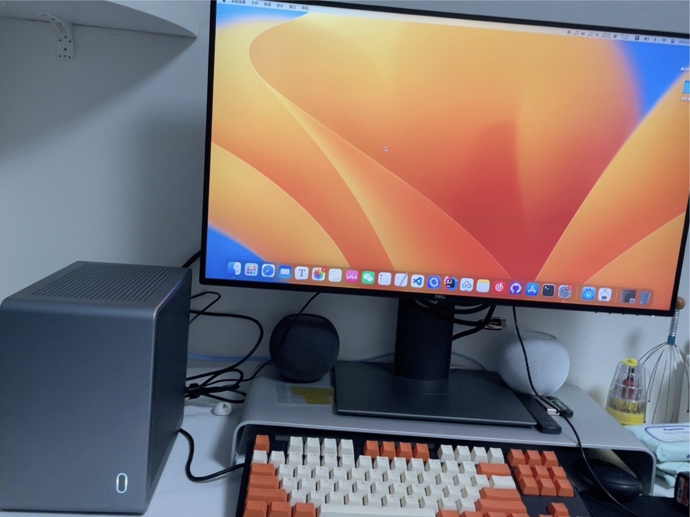
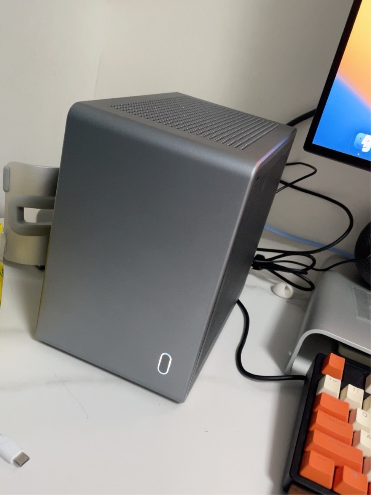

# ASUS-ROG-STRIX-Z490I-HACKINTOSH
# 华硕z490i黑苹果

## 电脑配置：

- cpu：i7-10700
- 显卡：撼讯RX6600XT竞技
- 主板：ASUS ROG STRIX Z490I 
- 网卡：AX201（该主板Wi-Fi采用CNVI协议，不支持替换Z3和Z4，本人已尝试，分享一下）
- 硬盘：
  - m.2-1 --> SN750 1T（mac）
  - m.2-2 --> 三星980pro 1T(win 10)
  - SATA3 --> WD 2T
- 机箱：麻雀COOJ MQ6

**参考EFI链接：https://github.com/jergoo/Hackintosh-ROG-STRIX-Z490I，感谢 jergoo ，EFI已经很完美了**

## 我做的修改：
1. Intel wifi 和 intel 蓝牙，jergoo是采用了博通免驱卡，我采用了intel wifi

2. 补齐了电源5项，其实没什么用，强迫症而已

   *注:使用EFI请自行添加上序列号等信息*

   

## 我遇到的问题：

1. Monterey 12.2中， intel Wi-Fi 的stable 版本不支持，跑完码后黑屏，要用alpha版本
2. 貌似usb定制完要重置nvram才生效，不然还是睡眠秒醒

# 更新日志

| 序号 |    时间    |  OC版本  |      系统版本       |                           改动内容                           |
| :--: | :--------: | :------: | :-----------------: | :----------------------------------------------------------: |
|  1   | 2022.07.13 | OC 0.8.2 | Ventura 13.0 公测版 | 1.更新 OC 0.8.2 2.勾选 kernel-->quirks-->DisableRtcChecksum，解决华硕主板卡 F1的情况 |
|  2   | 2024.02.19 | OC 0.9.8 |     Sonoma 14.3     | 1.更新OC 版本 2.I225-V网卡打补丁,解决有线网导致的机器重启卡死问题(参考链接:https://bbs.pcbeta.com/forum.php?mod=viewthread&tid=1934671&highlight=I225-V) |
|  3   | 2024.04.21 | OC 0.9.9 |    Sonoma 14.4.1    | 1.更新OC 版本 2.增加 SSDT-SPPT.aml SSDT注入，完善AMD显卡在MacOS下的调度，经功率计测试，Windows下空闲时待机功率 50-80w左右，未注入前MacOS下功率60-120w左右，注入SSDT SSDT-SPPT.aml 完善后，待机功率在 20-50w之间 |
|      |            |          |                     |                                                              |
|      |            |          |                     |                                                              |
